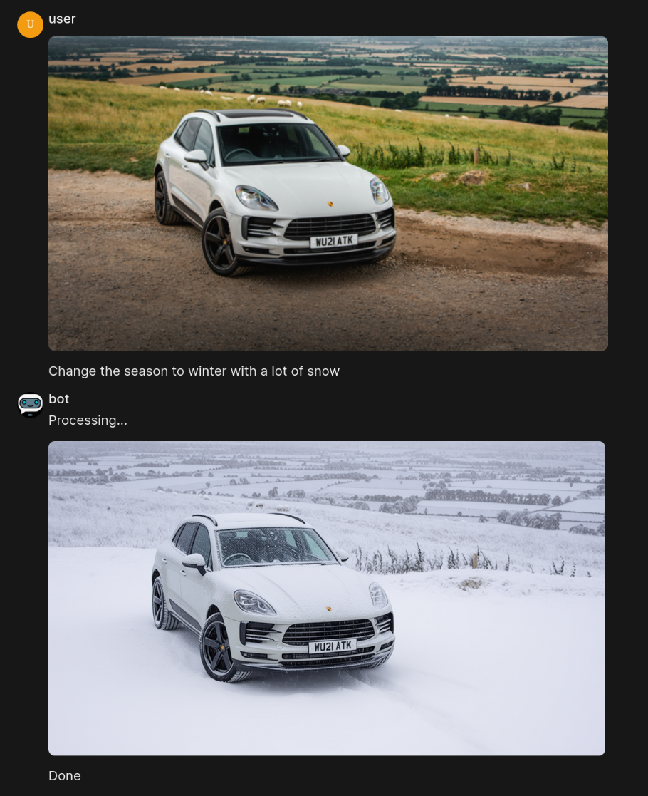

# Qwen/Flux Kontext Image edit (and not only) bot for Openwebui

This is a simple bot for [openwebui](https://github.com/open-webui/open-webui) that allows you to create a channel-wrapper around any [ComfyUI](https://github.com/comfyanonymous/ComfyUI) workflow that has one prompt or one image input, and one image output



This repo is based on two examples: [open-webui/bot](https://github.com/open-webui/bot) and [websockets_api_example.py](https://github.com/comfyanonymous/ComfyUI/blob/master/script_examples/websockets_api_example.py)

## Requirements
You can use the same environment that openwebui uses (it already has all dependencies), or create your own. Dependencies are `pip install dotenv pillow websocket-client python-socketio`

## How to set it up:
- enable channels in openwebui's admin setting
- create an account with admin rights for your bot
- create a channel with your desired name, e.g. `qwen-image-edit`. Make it public or private for the same group where both you and bot are
- have a working comfy ui with your workflow. I assume you already have it
- put text `prompt here` as a prompt (the bot will find the node by this text and replace it with proper prompt)
- delete all preview image nodes and similar, you need to have only one image out
- export it for API, and put the json file inside bot's `workflows/` directory
- set up `.env` file: the most important are bot's token and mapping *channel name* -> *workflow name*
- run the bot (`main.py`), openwebui and comfyui

## .env structure
```bash
WEBUI_URL="..." # default http://localhost:8080
TOKEN="..." # see below
COMFY_ADDRESS="..." # default localhost:8188
MAP_CHANNEL_NAME_WORKFLOW="..." #  see below
```

### TOKEN
To get it, log into bot's openwebui profile, go to `Settings` -> `Account` -> `API keys` -> `JWT Token`

### MAP_CHANNEL_NAME_WORKFLOW
This is a dictionary in json format that maps workflow and channel name. For example and by default `"{"qwen-image-edit": "qwen_image_edit"}"` means the bot will handle all messages from *"qwen-image-edit"* channel, send all user's requests there into *"workflows/qwen_image_edit.json"*. You can add channels and workflows how many you want
